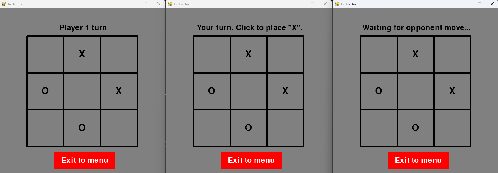

# Industry track

## Tic-Tac-Toe Game

## About the project

Tic-tac-toe is a game where two players take turns to add a marker to a 3x3 grid. Whoever gets 3 of their markers in a line (horizontal, vertical or diagonal) wins the game.

An example of the grid, with one player using X and another O as the marker:

  <br>X O X
  <br>O X O
  <br>X O X

In the above example, the player with marker X would be the winner for getting 3 X's in a row diagonally.

This project uses a Python implementation of tic-tac-toe to demonstrate a client-server structure. Clients can connect to the server as authorised “players," which then take turns updating the server's data (game status). 
Only one tic-tac-toe game is ongoing on the server at any given time.

<figure>
    
    <figcaption>User interface for the client</figcaption>
</figure>


## Implemented components:

<!--
Detailed description of the system architecture (Application-specific system components):
- System must have at least three nodes (e.g, containers)
- Each node must have a role: client, server, peer, broker, etc.

Participating nodes must:
- Exchange information (messages): RPC, client-server, publish/subscribe, broadcast, streaming, etc.
- Log their behavior understandably: messages, events, actions, etc.

Nodes (or their roles) do not have to be identical
For example, one acts as server, broker, monitor / admin, etc.
Each node must be an independent entity and (partially) autonomous

Detailed descriptions of relevant principles covered in the course (architecture, processes, communication, naming, synchronization, consistency and replication, fault tolerance); irrelevant principles can be left out.

-->

The system consists of a server and multiple clients. There can be a maximum of 2 player clients active, but other clients can be connected as viewers to get updates on the game status.
- The server keeps track of the game status and updates the clients on the game status.
- The client can display the game statuses that the server sends to it, and when it's the player's turn to make a move, the client will relay the player's turn (selected grid position) to the server.
- The server keeps sending updates about the game to connected player/viewer clients until the client stops acknowledging the updates.


## Built with:
<!--
Detailed description of the system functionality and how to run the implementation ( note that there is a separate getting started section right below this so... )

- If you are familiar with a particular container technology, feel free to use it (Docker is not mandatory)
- Any programming language can be used, such as: Python, Java, JavaScript, ..
- Any communication protocol / Internet protocol suite can be used: HTTP(S), MQTT, AMQP, CoAP, ..
-->

- Python 12.3
- Pygame 2.5.2

Communication: 
- TCP

Database:
- SQLite


## Getting Started:
<!--
Instructions on setting up your project locally
-->
To start the project server to test it on your own computer, you must first start the server and then connect to it with client instances.

### Running the server:
1. Download the project (if you downloaded it as a zip file, remember to unzip the files before continuing)
2. Run the following (note that everything after [ is optional) : 
```
python src/server/server.py [--host (host-ip) --port (host-port)]
```
On Windows to run the above command you can use Command prompt (Press Windows key + R, then type cmd, and finally click OK). All the commands detailed below can be run through Command prompt, or similar tools. Note that you may have to navigate to the project folder in Command prompt, or it will not be able to locate the game files.

For more information about the commands the project supports, you can run: 
```
python src/server/server.py --help
```
<mark>NOTICE</mark> : The server will generate a database file named 'user.db' in case it is not already present.

While the server is running, it will wait for input. You have the following command options:
- help: list available commands
- quit: stop running the server
- status: prints out the current game status and the number of connected clients.


While the server is running, you can start connecting to it with clients. 
To start a client to join a game of tic-tac-toe, you don't have to download the project files again. However, if you are using Windows Command prompt to run the project, you should open a new Command prompt window or tab for _each client instance_ you want to start.

### Running a client instance (to play or view the game):
1. Make sure you've followed the steps to start the game server first, otherwise, the client has nothing to connect to.
2. Run the following (note that everything after [ is optional):
```
python src/client/client.py [--address (server-address) --port (server-port)]
```


If you don't have pygame installed, you will get an error message such as "ModuleNotFoundError: No module named 'pygame'".
You can fix this error by installing the module:
```
pip install pygame
```

For more information on the available game client commands you can run: 
```
python src/client/client.py --help
```


## Results of the tests:
<!--
Detailed description of the system evaluation
Evaluate your implementation using selected criteria, for example:
- Number of messages / lost messages, latencies, ...
- Request processing with different payloads, ..
- System throughput, ..


Design two evaluation scenarios that you compare with each other, for example:
- Small number / large number of messages
- Small payload / big payload

Collect numerical data of test cases:
- Collecting logs of container operations
- Conduct simple analysis for documentation purposes (e.g. plots or graphs)
-->
We were interested in the update speed perceived on the client side. The evaluation is focused on how the amount of traffic affects the performance of the system. 

Evaluating the system performance by observing the time it takes for game status to update to the client instances from the player clients, as measured by observing the updates on the GUI. This measures the lag observed by the human user of the system but is not sensitive to minor changes in update speed. There was no change perceived in the speed of the updates when comparing a game with 1 or 10 viewers when the testing was done manually without precise timers. All updates were displayed on all clients, both Player and Viewer clients, in under one second, but the updates were not perceived as instantaneous. 

In the table below the timestamps from the logs are compared. The server and player clients are run locally and Docker service is used to run multiple viewer clients at once (without UI, but just connecting straight to the server as a viewer client). Tested with 1, 10  and 25 viewers and no performance issues are visible yet. 25 viewers + 2 players is still a small network and the system could be tested with more stress for more comprehensive analysis. 

|                                  | With 1 viewer  | With 10 viewers | With 25 viewers |
|----------------------------------|----------------|-----------------|-----------------|
| Average delay towards viewer(s)  |  567ms         |  510ms          |  518ms          |
| Average delay towards players(s) |  144ms         |  122ms          |  117ms          |	
| Total(s)                         |  285ms         |  445ms          |  487ms          |

	
The reason for not going further with the number of clients was in the data preprocessing and analysing, which we didn’t have so much time within the schedule of the project. Docker volume was used to export the logs from the viewer clients and they were then analyzed half-manually with Excel.  

In each case, one tie game with 9 player moves was played.  
- The server logged the timestamps and the game state identifier when it received a move from the player in turn.  
- Each viewer and player client logged the timestamps when they got the updated game status and were changing the view, in addition to the corresponding game status identifier.  
- The server timestamps of new moves were then compared to corresponding updates in clients and the average was calculated.  

It is worth noting that even though the total average goes up slightly when the amount of viewers increases, it’s mainly because of the proportion of the viewers versus players. The average delay for receiving the updated game status was generally higher for viewers than for the players, which was observed in manual testing as well. The average waiting time within groups is still on the same level in all cases; the delay didn’t grow significantly for players or viewers during the tests. 

It should also be noted that the viewer clients were run using Docker containers, while the players and the server were running at the local host. To get more advanced results, the data collecting/preprocessing/analysis should be done more automatically.  


## Acknowledgments:
<!-- 
list resources you find helpful
-->

The original game logic for tic-tac-toe in python by krishkamani on github https://github.com/krishkamani/Tic-Tac-Toe-Game-In-Python/tree/master

Python multiplayer online game tutorial by Tech With Tim on YouTube https://www.youtube.com/playlist?list=PLzMcBGfZo4-kR7Rh-7JCVDN8lm3Utumvq

